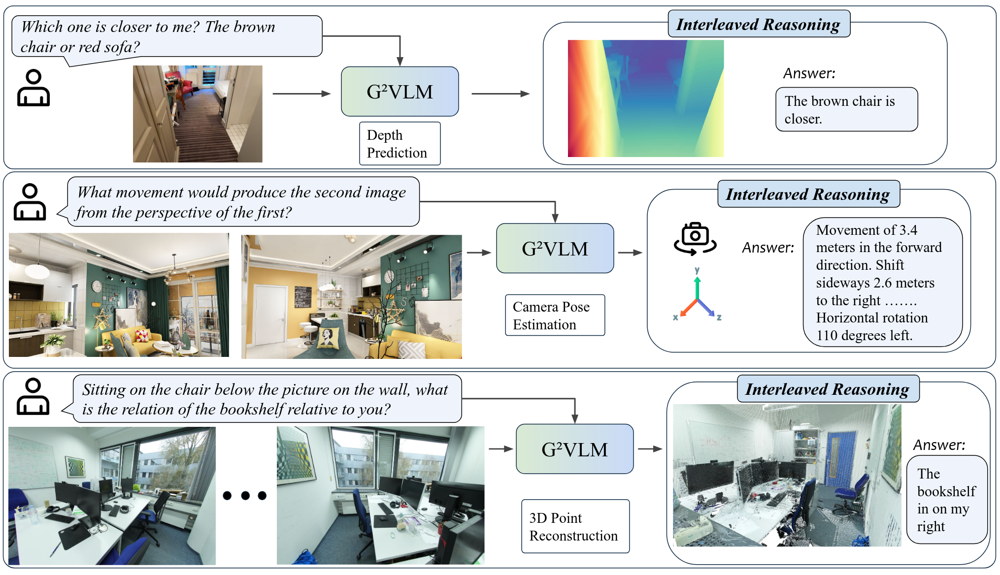
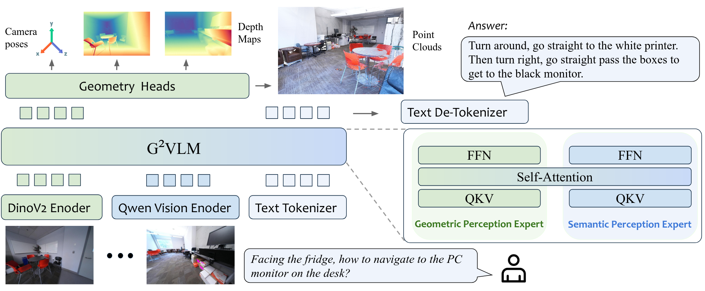

<p align="center">

<!-- <h1 align="center"><strong>G<sup>2</sup>VLM: Geometry Grounded Vision Language Model with Unified 3D Reconstruction and Spatial Reasoning</strong></h1>
</div> -->

<h1 align="center"><strong>G<sup>2</sup>VLM: Geometry Grounded Vision Language Model with Unified 3D Reconstruction and Spatial Reasoning</strong></h1>
</div>


<p align="center">
    <a href="https://gordonhu608.github.io">Wenbo Hu</a><sup>1,2*</sup>,
    <a href="https://openreview.net/profile?id=~Jingli_Lin1">Jingli Lin</a><sup>1,3*</sup>,
    <a href="https://openreview.net/profile?id=~Yilin_Long2">Yilin Long</a><sup>1,4*</sup>,
    <a href="https://openreview.net/profile?id=~Yunlong_Ran1">Yunlong Ran</a><sup>1,5</sup>,
    <a href="https://jianglh-whu.github.io/">Lihan Jiang</a><sup>1,6</sup>,
    <a href="https://github.com/yyfz">Yifan Wang</a><sup>1,3</sup>,
    <a href="https://zcmax.github.io/">Chenming Zhu</a><sup>1,7</sup>,
    <a href="https://runsenxu.com/">Runsen Xu</a><sup>1,8</sup>,
    <a href="https://tai-wang.github.io/">Tai Wang</a><sup>1&dagger;</sup>,
    <a href="https://oceanpang.github.io/">Jiangmiao Pang</a><sup>1&dagger;</sup>
</p>

<p align="center">
  <sup>1</sup>Shanghai AI Lab,
  <sup>2</sup>UCLA,
  <sup>3</sup>SJTU,
  <sup>4</sup>FDU,
  <sup>5</sup>ZJU,
  <sup>6</sup>USTC,
  <sup>7</sup>HKU,
  <sup>8</sup>CUHK
</p>

<p align="center">
  <sup>*</sup>Equal Contribution &nbsp;&nbsp;
  <sup>&dagger;</sup>Corresponding Author
</p>

<p align="center">
  <a href="https://arxiv.org/pdf/2511.21688">📑 Paper</a>  |
  <a href="https://arxiv.org/abs/2511.21688">📖 arXiv</a>  |
  <a href="https://gordonhu608.github.io/g2vlm.github.io/">🌐 Homepage</a> |
  <a href="https://huggingface.co/InternRobotics/G2VLM-2B-MoT">🤗 Model</a>
</p>

## 🏠 About
<div style="text-align: center;">
    
</div>
    We present <b>G<sup>2</sup>VLM</b>, a geometry grounded vision-language model proficient in both spatial 3D reconstruction and spatial
    understanding tasks. For spatial reasoning questions, G<sup>2</sup>VLM can natively predict 3D geometry and employ interleaved reasoning for an answer.

## 📢 News
- [Coming!] 📝 We will release our training code in the [train folder](./train).
- [Coming!] 📝 We will release the checkpoint of G<sup>2</sup>VLM-SR, a strong spatial reasoning model. Stay tuned! 
- [2025-11-27] 🔥 We release the example training data preprocessing code in the [data folder](./data).
- [2025-11-27] 🔥 We release the inference code and the checkpoint of G<sup>2</sup>VLM.
- [2025-11-27] 🔥 We release the [paper](https://arxiv.org/abs/2511.21688) of G<sup>2</sup>VLM.

<!-- contents with emoji -->
<!-- ## 📋 Contents
- [🤖 Online Demo](#-online-demo)
- [💬 Dialogue Examples](#-dialogue-examples)
- [🔍 Overview](#-overview)
- [📦 Training and Evaluation](#-training-and-evaluation)
- [📝 TODO List](#-todo-list)
- [🔗 Citation](#-citation)
- [📄 License](#-license)
- [👏 Acknowledgements](#-acknowledgements) -->


### Model
<p align="center">
  
</p>
G<sup>2</sup>VLM is a unified model that integrates both a geometric perception expert for 3D reconstruction and a semantic perception expert for multimodal understanding and spatial reasoning tasks. All tokens can do shared multi-modal self attention in each transformer block.


## 🚀 Quick Start

1️⃣  Set up environment
```bash
git clone https://github.com/InternRobotics/G2VLM
cd G2VLM
conda create -n g2vlm python=3.10 -y
conda activate g2vlm

pip install torch==2.5.1 torchvision==0.20.1 torchaudio==2.5.1 --index-url https://download.pytorch.org/whl/cu121
pip install -r requirements.txt
```

Optional: For training
```bash
pip install https://github.com/Dao-AILab/flash-attention/releases/download/v2.7.4.post1/flash_attn-2.7.4.post1+cu12torch2.5cxx11abiFALSE-cp310-cp310-linux_x86_64.whl
```


2️⃣  Download pretrained checkpoint
```python
from huggingface_hub import snapshot_download

save_dir = "models/G2VLM-2B-MoT"
repo_id = "InternRobotics/G2VLM-2B-MoT"
cache_dir = save_dir + "/cache"

snapshot_download(cache_dir=cache_dir,
  local_dir=save_dir,
  repo_id=repo_id,
  local_dir_use_symlinks=False,
  resume_download=True,
  allow_patterns=["*.json", "*.safetensors", "*.bin", "*.py", "*.md", "*.txt"],
)
```

3️⃣ Run Inference from Command Line

Try our example inference script. You can run it on a directory of images. Here is the script for 3D recontruction.

```bash
# Run with default example images
python inference_recon.py

# Run on your own data (image folder)
python inference_recon.py --data_path <path/to/your/images_dir>
```

Here is the script for spatial reasoning task.

```bash
# Run with default example images and default question
python inference_chat.py

# Run on your own data (image folder) and question
python inference_recon.py --data_path <path/to/your/images_dir> --question "How far is the chair from me in the image?"
```

**Optional Arguments:**

  * `--data_path`: Path to the input image directory or a video file. (Default: `examples/recon_images`)
  * `--question`: Input question. (Default: `How far is the chair from me in the image?`)
  * `--save_path`: Path to save the output `.ply` point cloud. (Default: `examples/result.ply`)
  * `--ckpt`: Path to a custom model checkpoint file.
  * `--device`: Device to run inference on. (Default: `cuda`)


## 🔗 Citation

If you find our work and this codebase helpful, please consider starring this repo 🌟 and cite:

```bibtex
@{hu2025g2vlmgeometrygroundedvision,
      title={G$^2$VLM: Geometry Grounded Vision Language Model with Unified 3D Reconstruction and Spatial Reasoning}, 
      author={Wenbo Hu and Jingli Lin and Yilin Long and Yunlong Ran and Lihan Jiang and Yifan Wang and Chenming Zhu and Runsen Xu and Tai Wang and Jiangmiao Pang},
      year={2025},
      eprint={2511.21688},
      archivePrefix={arXiv},
      primaryClass={cs.CV},
      url={https://arxiv.org/abs/2511.21688}, 
}
```

## 📄 License
G<sup>2</sup>VLM is licensed under the Apache 2.0.


## 👏 Acknowledgements
- [Bagel](https://github.com/ByteDance-Seed/Bagel): Our codebase is built upon Bagel.
- [Pi3](https://github.com/yyfz/Pi3): We develop our visual geometric expert based on Pi3.
- [VGGT](https://github.com/facebookresearch/vggt): We thank VGGT for their efforts in visual geometry learning.

